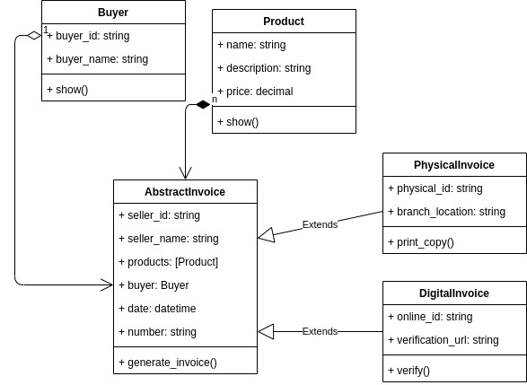

## Solid Invoice generator excercises

Problem:

Suppose we are starting to write an Invoice generator program with Single Responsibility, but suppose we only need some CoffeeShop invoices. The function generateInvoice does not conform to the open-closed principle because it cannot be closed against new kinds of CoffeeShop. For every new company, a new logic is added to the generateInvoice function. When your application grows and becomes complex, you will see that the if statement would be repeated over and over again in the generateInvoice function each time a new company is added, all over the application.

Diagram:



execute:

```bas
python3 main.py
```